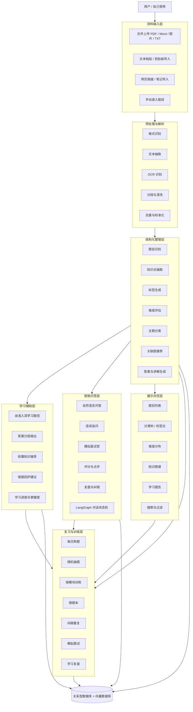
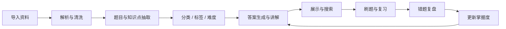

# 01_System_Architecture

## 1. 产品系统功能架构总览

本产品是一个面向 **AI 应用开发工程师面试准备** 的个人知识中枢。核心目标不是简单存储题目，而是将分散的面试题、笔记、项目经历、资料文档，自动转化为 **结构化知识、可训练题库、可追踪复习体系和可对话式学习体验**。

系统按照 6 大核心模块拆解如下：

1. **资料输入层**：统一接收文件、文本、截图、网页等多源内容。
2. **结构化整理层**：将原始资料抽取为题目、知识点、标签、难度、关联关系。
3. **学习辅助层**：提供由浅入深的学习路径、答案分层、复习推荐。
4. **智能问答层**：基于 LangGraph 的对话式学习、追问、模拟面试、错题复盘。
5. **展示浏览层**：以知识库、题目列表、标签树、图谱、统计面板呈现内容。
6. **复习与训练层**：错题集、间隔重复、刷题训练、模拟面试、学习报告。

---

## 2. 系统功能架构图

---

## 3. 六大模块的子功能拆解

### 3.1 资料输入层
目标：让任何形式的资料都能快速进入系统。

子功能：
- 上传 PDF / Word / 图片 / 截图 / TXT
- 粘贴面试题或知识点文案
- 导入网页内容
- 手动添加题目
- 批量导入历史整理内容
- 自动记录来源和导入时间

### 3.2 结构化整理层
目标：把原始文本变成可管理的知识资产。

子功能：
- 题目切分与提取
- 知识点识别
- 自动分类与打标签
- 难度打分
- 题型识别（概念题、场景题、对比题、架构题等）
- 答案生成
- 关联题推荐
- 追问点提取

### 3.3 学习辅助层
目标：把题目变成学习路径，而不是单条记录。

子功能：
- 按难度排序
- 按知识依赖排序
- 生成由浅入深的学习路线
- 输出不同粒度答案（30 秒版、1 分钟版、深度版）
- 标记薄弱知识点
- 推荐前置知识
- 学习计划与提醒

### 3.4 智能问答层
目标：让系统像老师、面试官、陪练助手一样互动。

子功能：
- 基础问答
- 连续追问
- 模拟面试
- 自动评分
- 对回答进行纠错和补充
- 上下文记忆
- 错题复盘
- 题目引导式讲解

### 3.5 展示浏览层
目标：让知识库可视化、可浏览、可检索。

子功能：
- 题目列表页
- 题目详情页
- 标签云
- 分类树
- 难度分布图
- 知识图谱视图
- 学习报告面板
- 搜索与筛选

### 3.6 复习与训练层
目标：形成“输入—理解—练习—复盘—强化”的闭环。

子功能：
- 刷题模式
- 错题集
- 间隔重复复习
- 每日任务
- 模拟面试
- 限时回答
- 连续答题
- 训练结果统计

---

## 4. 关键设计原则

- **个人优先**：不做复杂登录与多人权限，先保证自己好用。
- **结构化优先**：所有内容必须最终沉淀成可检索、可排序、可复习的数据。
- **智能体优先**：不是单纯 CRUD，而是围绕学习流程设计 AI 行为。
- **渐进式学习**：同一题支持从浅到深、多粒度输出。
- **可扩展**：后续可接入语音、浏览器插件、移动端、分享功能。

---

## 5. 核心业务流

---

## 6. 未来可扩展方向

- 多模态输入：图片题、语音题、手写笔记
- 浏览器插件：一键收藏网页面经
- AI 出题：根据知识点自动反向生成题目
- 个人知识图谱：支持知识依赖关系可视化
- 行为追踪：学习习惯与复习效率分析
- 语音陪练：模拟面试口语表达训练

