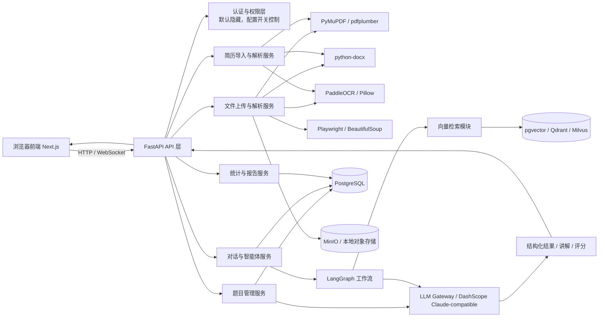

# 02_Tech_Stack_Design

## 1. 设计目标

本项目面向 **AI 应用开发工程师面试准备** 场景，技术方案需要同时满足：

- 资料导入与解析能力强
- 智能体工作流可编排、可扩展
- 支持结构化知识库与语义检索
- 前端轻量、易维护、便于快速迭代
- 后端适合 AI 原生业务与模型调用
- 未来可从单用户平滑扩展到多用户

### 1.1 架构演进基调

本项目采用 **模块化单体** 路线，MVP 阶段不做微服务化拆分，但必须在工程上预留扩展点。

### 1.2 新增核心能力：简历驱动面试题生成

MVP 必须支持上传简历后自动解析技术栈、项目经历与职责描述，并基于这些结构化结果生成“只围绕你本人简历内容”的面试题，而不是凭空出题。该能力必须与题库、标签、知识节点、学习记录、LangGraph 工作流复用同一套底座。

### 1.2 关键决策

- **后端**：Python + FastAPI + LangGraph
- **简历解析**：PyMuPDF / python-docx / PaddleOCR / 结构化抽取模型
- **主模型供应商**：阿里云 DashScope 兼容 Claude API 风格的接入方式
- **简历出题策略**：基于简历解析结果做技术栈映射、项目追问与知识节点召回
- **Embedding**：本地 `D:\AI_Project\models\bge-small-zh-v1.5`
- **Reranker**：本地 `D:\AI_Project\models\bge-reranker-v2-m3`
- **数据库**：PostgreSQL + pgvector
- **前端**：Next.js + TypeScript + Tailwind CSS + shadcn/ui
- **认证**：基础登录能力必须实现，但默认隐藏，由配置开关控制
- **仓库形态**：前后端同仓

---

## 2. 前端技术方案

### 2.1 推荐技术栈

- **Next.js**：支持 App Router，适合页面与 API 协同开发
- **React**：组件化构建知识库与对话页面
- **TypeScript**：提高复杂数据结构与状态管理的可靠性
- **Tailwind CSS**：高效实现现代化界面
- **shadcn/ui**：快速搭建统一风格的高质量组件
- **TanStack Query**：管理服务端状态、缓存与请求
- **Zustand**：管理局部 UI 状态，例如筛选、选中题目、侧边栏状态
- **React Markdown / MDX**：渲染答案、讲解、学习笔记
- **ECharts / Recharts**：展示难度分布、学习曲线、模块占比

### 2.2 选择理由

- 这个产品核心是“浏览 + 对话 + 知识组织”，Next.js 很适合做多页面交互。
- TypeScript 可降低题目、标签、学习记录等复杂对象的维护成本。
- Tailwind + shadcn/ui 能快速做出干净、专业、偏工具类的界面。
- 对于个人项目，前端不必过度重型化，重点是快速迭代。

---

## 3. 后端 API 层技术方案

### 3.1 推荐技术栈

- **FastAPI**：高性能、类型清晰、自动生成 OpenAPI 文档
- **Pydantic**：定义请求响应模型与数据校验
- **SQLAlchemy 2.0 / SQLModel**：ORM 层
- **Alembic**：数据库迁移
- **Uvicorn**：ASGI 服务
- **LangGraph**：实现智能体流程编排
- **阿里云 DashScope 兼容接口**：作为主 LLM 调用入口
- **本地 Embedding 模型**：作为向量化主方案
- **python-multipart**：文件上传支持
- **pymupdf (fitz)**：PDF 文本解析
- **python-docx**：Word 文档解析
- **Pillow**：图片处理
- **PaddleOCR**：图片 OCR 识别
- **BeautifulSoup / Playwright**：网页内容提取（可选）
- **tenacity**：重试与容错

### 3.2 选择理由

- FastAPI 非常适合构建 AI 产品 API，因为接口定义清晰，和 Pydantic 强绑定。
- LangGraph 适合有状态的多步推理任务，尤其适合你的“提取—分类—讲解—追问—复盘”流程。
- Python 在文档解析、OCR、NLP、向量检索生态方面非常成熟。
- 统一模型入口后，后续切换供应商不会影响业务层。

---

## 4. AI 模型层设计

### 4.1 核心模型职责

- **文本理解模型**：提取题目、知识点、标签、难度
- **生成模型**：生成答案、讲解、复习建议、学习计划
- **评估模型**：对用户回答进行打分和纠错
- **检索增强模型**：结合向量召回和上下文生成回答

### 4.2 推荐模型使用方式

- **主模型**：阿里云 DashScope 兼容 Claude 风格调用
- **Embedding 模型**：本地 `bge-small-zh-v1.5`
- **Reranker 模型**：本地 `bge-reranker-v2-m3`
- **扩展模型**：通过配置切换到云端 embedding / reranker

### 4.3 AI 调用策略

- 小任务优先走规则与结构化抽取
- 复杂任务交给智能体工作流
- 对话阶段优先检索知识库再生成
- 统一加上输出 JSON Schema，减少幻觉和格式漂移
- 所有模型调用必须经过 `LLMGateway`

---

## 5. 数据存储层技术方案

### 5.1 关系型数据库

推荐 **PostgreSQL**，用于存储：

- 用户自定义题目
- 知识点标签
- 学习记录
- 对话历史
- 题目与题目之间的关系
- 文件元信息
- 训练记录
- prompt 版本与模型版本记录

### 5.2 向量数据库

可采用以下两种策略：

#### 方案 A：PostgreSQL + pgvector
- 适合个人项目、MVP、部署简单
- 查询与存储统一在一个数据库中
- 运维成本低

#### 方案 B：Qdrant / Milvus
- 适合后续数据量变大
- 向量检索能力更强
- 易扩展为多知识库系统

### 5.3 文件存储

- 本地 `uploads/` 目录：开发阶段方便
- MinIO：后续可替代本地磁盘，支持对象存储语义

---

## 6. 文件解析工具链设计

### 6.1 PDF 解析

推荐链路：

- `PyMuPDF`：提取文本、页码、版式信息
- `pdfplumber`：补充提取表格与布局
- 若遇到扫描版 PDF：走 OCR

### 6.2 Word 解析

推荐链路：

- `python-docx`：读取 docx 内容、标题、段落、列表
- 若是旧版 doc：可先转换为 docx 或 txt

### 6.3 图片 / 截图解析

推荐链路：

- `Pillow`：加载与预处理图片
- `PaddleOCR`：文本识别
- `OpenCV`：可选，用于图像去噪、裁剪、二值化

### 6.4 网页解析

推荐链路：

- `BeautifulSoup4`：解析静态 HTML
- `Playwright`：处理动态网页与 JS 渲染页面

### 6.5 文本清洗流程

- 去除多余空白
- 标准化换行与标点
- 按段落 / 标题 / 编号切片
- 合并碎片句子
- 识别问答对结构
- 生成统一的中间结构

---

## 7. 整体系统架构流转图



---

## 8. 配置与可切换性设计

### 8.1 配置入口

所有模型、数据库、认证、文件路径都必须通过环境变量配置：

- `LLM_PROVIDER`
- `LLM_BASE_URL`
- `LLM_API_KEY`
- `LLM_MODEL_NAME`
- `EMBEDDING_PROVIDER`
- `EMBEDDING_MODEL_PATH`
- `RERANKER_MODEL_PATH`
- `AUTH_ENABLED`
- `PUBLIC_MODE`
- `DATABASE_URL`

### 8.2 设计要求

- 本地模型与云端模型可以无缝切换
- 不允许在业务逻辑中硬编码模型路径
- 不允许在代码里写死 API Key
- 不允许前端通过编译期常量决定后端能力

---

## 9. 推荐部署拓扑

### MVP 阶段
- 前端：Next.js 本地开发 + Vercel 或静态部署
- 后端：FastAPI 单体服务
- 数据库：PostgreSQL + pgvector
- 文件存储：本地磁盘

### 后续扩展阶段
- 引入 Redis 队列处理解析任务
- 引入 MinIO 存储文件
- 向量库独立部署
- 智能体服务拆分为独立模块

---

## 11. 认证与登录设计

### 11.1 设计原则

- **默认关闭**：`AUTH_ENABLED=false` 时所有接口开放，单用户模式
- **配置开关**：通过环境变量 `AUTH_ENABLED=true` 启用登录
- **不破坏现有体验**：无认证接口不受影响，受保护接口通过 `Depends(get_current_user)` 按需挂载

### 11.2 技术选型

| 组件 | 方案 | 说明 |
|------|------|------|
| 密码哈希 | `passlib[bcrypt]` | bcrypt 算法，自动盐值 |
| JWT 令牌 | `python-jose[cryptography]` | HS256 算法 |
| Access Token | 30 分钟有效期 | 用于 API 请求鉴权 |
| Refresh Token | 7 天有效期 | 用于无感刷新 |
| 用户存储 | PostgreSQL `users` 表 | SQLModel 模型 |

### 11.3 用户模型

```
User(id: UUID, username: str unique, email: str unique nullable,
     password_hash: str, is_active: bool, created_at, updated_at)
```

### 11.4 API 端点

| 端点 | 方法 | 认证 | 说明 |
|------|------|------|------|
| `POST /api/v1/auth/register` | POST | 无 | 注册新用户 |
| `POST /api/v1/auth/login` | POST | 无 | 登录获取令牌 |
| `POST /api/v1/auth/refresh` | POST | 无 | 刷新访问令牌 |
| `GET /api/v1/auth/me` | GET | 需要 | 获取当前用户信息 |
| `GET /api/v1/auth/config` | GET | 无 | 获取认证配置（前端探测） |

### 11.5 令牌格式

```json
// Access Token payload
{"sub": "username", "exp": 1716000000}

// Refresh Token payload
{"sub": "username", "type": "refresh", "exp": 1716000000}
```

### 11.6 依赖注入

```python
@router.get("/protected")
async def protected_route(current_user: User = Depends(get_current_user)):
    # current_user 为已认证的数据库用户
    ...
```

当 `AUTH_ENABLED=false` 时，`get_current_user` 返回一个匿名占位用户，
使受保护路由仍能正常调用，不影响现有无认证接口。

---

## 10. 工程建议

- 所有 AI 输出必须走结构化 schema
- 解析、分类、讲解、评分分成独立服务或独立函数
- Prompt 与业务逻辑分离，便于迭代
- 记录每次模型调用参数与结果，便于排错
- 优先保证单用户体验，再考虑多用户与权限
- 登录能力先做完并隐藏，未来可通过配置开放

