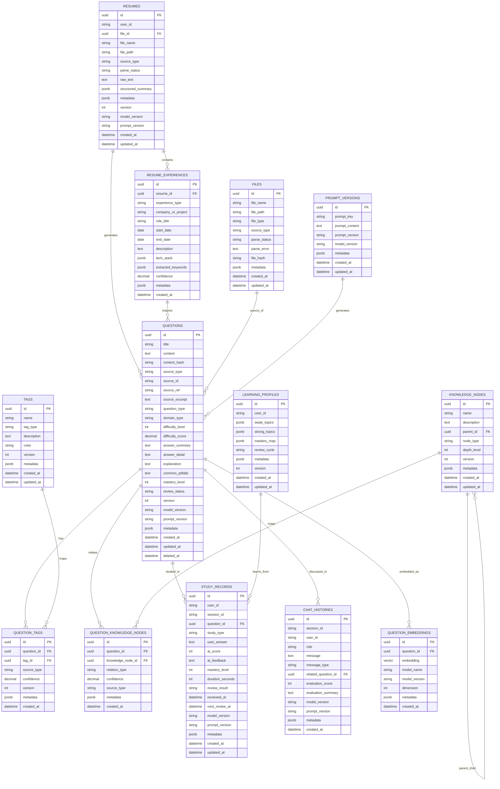

# 03_Database_Schema

## 1. 数据库设计目标

本项目的数据库设计不只是“能存数据”，而是要为未来持续迭代提供稳定底座。设计时必须同时满足：

- 原始资料可追溯
- 题目、标签、知识点可结构化管理
- 学习记录可统计、可复盘
- 对话历史可回放、可评估
- 向量检索可支撑相似题与知识召回
- AI 生成结果可版本化、可审计、可重跑
- 后续多用户、多模型切换时不需要推倒重来

### 1.1 架构演进约束

本项目采用 **PostgreSQL + pgvector** 作为 MVP 主方案，并且从第一版开始就遵守以下约束：

- 核心业务表必须保留扩展字段
- 核心业务表必须保留溯源字段
- 题目、标签、学习记录、对话记录要相互解耦
- AI 生成的内容与原始输入必须分离存储
- 不允许把模型输出直接当成唯一真相写死在单一字段中

### 1.2 数据层红线

- 不允许为了 MVP 简单而删除 `metadata`、`version`、`source_id` 等字段
- 不允许将所有 AI 结果塞进一个 `content` 字段
- 不允许缺失生成模型、prompt 版本、来源文件等追踪信息
- 不允许让知识点、题目、标签三者之间形成不可扩展的强耦合

---

## 2. 核心实体关系说明

- `Questions`：题目主表，存储题干、分类、难度、答案、来源、版本信息
- `Tags`：标签体系，如 `RAG`、`Agent`、`基础题`、`高频题` 等
- `Question_Tags`：题目与标签的多对多关系
- `Study_Records`：学习行为记录、复习记录、模拟面试记录
- `Chat_Histories`：智能体对话历史、回放、评分摘要
- `Files`：上传文件与解析状态，作为知识来源入口
- `Knowledge_Nodes`：知识点与依赖关系，支撑知识图谱和学习路径
- `Question_Embeddings`：题目向量，用于语义检索与相似题召回
- `Question_Knowledge_Nodes`：题目与知识节点的多对多关系
- `Resumes`：简历原始文件与解析结果
- `Resume_Experiences`：简历中的项目经历、技术栈、职责拆解
- `Prompt_Versions`：prompt 模板版本与模型配置记录，支撑 AI 可追溯性
- `Learning_Profiles`：用户学习画像与掌握程度缓存，后续多用户扩展时使用

---

## 3. 设计原则

### 3.1 解耦原则

- 题目表只负责“题目事实”，不要承载所有派生信息
- AI 生成的答案、讲解、评价应尽量作为派生结果保存
- 标签是独立实体，不要把标签名直接硬编码到题目字段里
- 学习记录独立于题目，避免未来难以支持同题多次训练

### 3.2 可演进原则

- 未来如需支持多模型，题目、答案、评分记录必须能存 `model_version`
- 未来如需支持多轮复盘，学习记录必须可关联 session
- 未来如需支持重新分类，必须能依据来源和版本重跑数据处理流程
- 未来如需支持知识图谱，必须保留知识节点的 parent / relation 结构

### 3.3 可审计原则

任何 AI 参与生成的数据都应能回答以下问题：
- 它从哪里来？
- 什么时候生成的？
- 哪个模型生成的？
- 使用了哪个 prompt 版本？
- 生成结果是否被人工修订过？

---

## 4. 核心表结构设计

### 4.1 Questions 题目表

> 题目表是全系统最重要的业务表之一。它必须能够支撑“导入、分类、讲解、复习、追问、统计”多种场景。

| 字段名 | 数据类型 | 是否必填 | 说明 |
|---|---:|---:|---|
| id | UUID / BIGSERIAL | 是 | 主键 |
| title | VARCHAR(500) | 是 | 题目标题 |
| content | TEXT | 是 | 题目正文 |
| content_hash | VARCHAR(128) | 否 | 用于去重与追踪原文变更 |
| source_type | VARCHAR(50) | 是 | 来源类型，如 upload/paste/manual/web |
| source_id | UUID / VARCHAR(255) | 否 | 来源文件 ID、外部文档 ID、URL ID |
| source_ref | VARCHAR(255) | 否 | 来源文件名、URL 或外部引用 |
| source_excerpt | TEXT | 否 | 题目原始摘录，用于溯源 |
| question_type | VARCHAR(50) | 否 | 题型，如 concept/compare/scenario/architecture |
| domain_type | VARCHAR(100) | 否 | 领域，如 RAG/Agent/LangGraph/Prompting |
| difficulty_level | INT | 否 | 难度等级，建议 1-5 |
| difficulty_score | NUMERIC(5,2) | 否 | 更细粒度的难度评分 |
| answer_summary | TEXT | 否 | 简版答案 |
| answer_detail | TEXT | 否 | 深度答案 |
| explanation | TEXT | 否 | 讲解内容 |
| common_pitfalls | TEXT | 否 | 常见易错点 |
| mastery_level | INT | 否 | 当前掌握程度，建议 1-5 |
| review_status | VARCHAR(50) | 否 | 待复习/已掌握/需强化等 |
| version | INT | 是 | 题目版本号 |
| model_version | VARCHAR(100) | 否 | 生成或更新该题目的模型版本 |
| prompt_version | VARCHAR(100) | 否 | 生成答案/分类时使用的 prompt 版本 |
| metadata | JSONB | 否 | 扩展信息，必须预留 |
| created_at | TIMESTAMP | 是 | 创建时间 |
| updated_at | TIMESTAMP | 是 | 更新时间 |
| deleted_at | TIMESTAMP | 否 | 软删除时间 |

### 4.2 Tags 标签表

| 字段名 | 数据类型 | 是否必填 | 说明 |
|---|---:|---:|---|
| id | UUID / BIGSERIAL | 是 | 主键 |
| name | VARCHAR(100) | 是 | 标签名称 |
| tag_type | VARCHAR(50) | 是 | 标签类型，如 domain/difficulty/status/custom |
| description | TEXT | 否 | 标签说明 |
| color | VARCHAR(20) | 否 | 前端展示颜色 |
| version | INT | 是 | 标签版本 |
| metadata | JSONB | 否 | 扩展字段 |
| created_at | TIMESTAMP | 是 | 创建时间 |
| updated_at | TIMESTAMP | 是 | 更新时间 |

### 4.3 Question_Tags 题目标签关联表

| 字段名 | 数据类型 | 是否必填 | 说明 |
|---|---:|---:|---|
| id | UUID / BIGSERIAL | 是 | 主键 |
| question_id | UUID / BIGINT | 是 | 关联题目 |
| tag_id | UUID / BIGINT | 是 | 关联标签 |
| source_type | VARCHAR(50) | 否 | 手动/AI 自动/规则命中 |
| confidence | NUMERIC(5,2) | 否 | 标签命中置信度 |
| version | INT | 是 | 关联版本 |
| metadata | JSONB | 否 | 扩展信息 |
| created_at | TIMESTAMP | 是 | 创建时间 |

### 4.4 Question_Knowledge_Nodes 题目知识节点关联表

> 这是知识图谱和学习路径的关键桥梁，必须存在。

| 字段名 | 数据类型 | 是否必填 | 说明 |
|---|---:|---:|---|
| id | UUID / BIGSERIAL | 是 | 主键 |
| question_id | UUID / BIGINT | 是 | 关联题目 |
| knowledge_node_id | UUID / BIGINT | 是 | 关联知识节点 |
| relation_type | VARCHAR(50) | 是 | prerequisite / related / same_domain / deepens |
| confidence | NUMERIC(5,2) | 否 | 关系置信度 |
| source_type | VARCHAR(50) | 否 | manual/ai/rule |
| metadata | JSONB | 否 | 扩展字段 |
| created_at | TIMESTAMP | 是 | 创建时间 |

### 4.5 Resumes 简历表

| 字段名 | 数据类型 | 是否必填 | 说明 |
|---|---:|---:|---|
| id | UUID / BIGSERIAL | 是 | 主键 |
| user_id | UUID / VARCHAR(255) | 否 | 用户标识，预留多用户能力 |
| file_id | UUID / BIGINT | 是 | 关联上传文件 |
| file_name | VARCHAR(255) | 是 | 简历文件名 |
| file_path | VARCHAR(500) | 是 | 文件存储路径 |
| source_type | VARCHAR(50) | 是 | upload/paste/manual |
| parse_status | VARCHAR(50) | 是 | pending/processing/success/failed |
| raw_text | TEXT | 否 | 简历解析后的原始文本 |
| structured_summary | JSONB | 否 | 结构化简历摘要 |
| metadata | JSONB | 否 | 扩展字段 |
| version | INT | 是 | 简历版本 |
| model_version | VARCHAR(100) | 否 | 解析模型版本 |
| prompt_version | VARCHAR(100) | 否 | 解析 prompt 版本 |
| created_at | TIMESTAMP | 是 | 创建时间 |
| updated_at | TIMESTAMP | 是 | 更新时间 |

### 4.6 Resume_Experiences 简历经历表

| 字段名 | 数据类型 | 是否必填 | 说明 |
|---|---:|---:|---|
| id | UUID / BIGSERIAL | 是 | 主键 |
| resume_id | UUID / BIGINT | 是 | 关联简历 |
| experience_type | VARCHAR(50) | 是 | work/project/education/skill |
| company_or_project | VARCHAR(255) | 否 | 公司名或项目名 |
| role_title | VARCHAR(255) | 否 | 职位或角色 |
| start_date | DATE | 否 | 开始时间 |
| end_date | DATE | 否 | 结束时间 |
| description | TEXT | 否 | 经历描述 |
| tech_stack | JSONB | 否 | 技术栈列表 |
| extracted_keywords | JSONB | 否 | 抽取关键词 |
| confidence | NUMERIC(5,2) | 否 | 解析置信度 |
| metadata | JSONB | 否 | 扩展字段 |
| created_at | TIMESTAMP | 是 | 创建时间 |

### 4.7 Study_Records 学习记录表

| 字段名 | 数据类型 | 是否必填 | 说明 |
|---|---:|---:|---|
| id | UUID / BIGSERIAL | 是 | 主键 |
| user_id | UUID / VARCHAR(255) | 否 | 用户标识，MVP 单用户可为空但预留 |
| session_id | VARCHAR(100) | 否 | 对话或训练会话 ID |
| question_id | UUID / BIGINT | 否 | 关联题目 |
| study_type | VARCHAR(50) | 是 | 学习类型，如 review/practice/mock/interview/chat |
| user_answer | TEXT | 否 | 用户回答 |
| ai_score | INT | 否 | AI 评分，建议 0-100 |
| ai_feedback | TEXT | 否 | AI 点评 |
| mastery_level | INT | 否 | 掌握度，建议 1-5 |
| duration_seconds | INT | 否 | 学习耗时 |
| review_result | VARCHAR(50) | 否 | 本次复习结论 |
| reviewed_at | TIMESTAMP | 是 | 学习发生时间 |
| next_review_at | TIMESTAMP | 否 | 下次复习时间 |
| model_version | VARCHAR(100) | 否 | 评分或点评所用模型版本 |
| prompt_version | VARCHAR(100) | 否 | 使用的 prompt 版本 |
| metadata | JSONB | 否 | 扩展信息 |
| created_at | TIMESTAMP | 是 | 创建时间 |
| updated_at | TIMESTAMP | 是 | 更新时间 |

### 4.6 Chat_Histories 对话复盘表

| 字段名 | 数据类型 | 是否必填 | 说明 |
|---|---:|---:|---|
| id | UUID / BIGSERIAL | 是 | 主键 |
| session_id | VARCHAR(100) | 是 | 对话会话 ID |
| user_id | UUID / VARCHAR(255) | 否 | 用户标识，预留多用户能力 |
| role | VARCHAR(20) | 是 | 角色，user/assistant/system |
| message | TEXT | 是 | 消息内容 |
| message_type | VARCHAR(50) | 否 | 消息类型，如 explanation/question/evaluation |
| related_question_id | UUID / BIGINT | 否 | 关联题目 |
| evaluation_score | INT | 否 | 本轮评价分数 |
| evaluation_summary | TEXT | 否 | 本轮复盘总结 |
| model_version | VARCHAR(100) | 否 | 对话生成模型版本 |
| prompt_version | VARCHAR(100) | 否 | 对话 prompt 版本 |
| metadata | JSONB | 否 | 扩展信息 |
| created_at | TIMESTAMP | 是 | 创建时间 |

### 4.7 Files 文件表

| 字段名 | 数据类型 | 是否必填 | 说明 |
|---|---:|---:|---|
| id | UUID / BIGSERIAL | 是 | 主键 |
| file_name | VARCHAR(255) | 是 | 文件名 |
| file_path | VARCHAR(500) | 是 | 存储路径 |
| file_type | VARCHAR(50) | 是 | pdf/docx/png/jpg/txt 等 |
| source_type | VARCHAR(50) | 是 | 上传、粘贴、网页导入等 |
| parse_status | VARCHAR(50) | 是 | pending/processing/success/failed |
| parse_error | TEXT | 否 | 解析错误信息 |
| file_hash | VARCHAR(128) | 否 | 文件去重与追踪 |
| metadata | JSONB | 否 | 扩展字段 |
| created_at | TIMESTAMP | 是 | 创建时间 |
| updated_at | TIMESTAMP | 是 | 更新时间 |

### 4.8 Knowledge_Nodes 知识点表

| 字段名 | 数据类型 | 是否必填 | 说明 |
|---|---:|---:|---|
| id | UUID / BIGSERIAL | 是 | 主键 |
| name | VARCHAR(200) | 是 | 知识点名称 |
| description | TEXT | 否 | 知识点说明 |
| parent_id | UUID / BIGINT | 否 | 上级知识点 |
| node_type | VARCHAR(50) | 是 | concept/prerequisite/topic |
| depth_level | INT | 否 | 知识层级 |
| version | INT | 是 | 知识节点版本 |
| metadata | JSONB | 否 | 扩展字段 |
| created_at | TIMESTAMP | 是 | 创建时间 |
| updated_at | TIMESTAMP | 是 | 更新时间 |

### 4.9 Question_Embeddings 向量表

| 字段名 | 数据类型 | 是否必填 | 说明 |
|---|---:|---:|---|
| id | UUID / BIGSERIAL | 是 | 主键 |
| question_id | UUID / BIGINT | 是 | 关联题目 |
| embedding | VECTOR | 是 | 向量表示 |
| model_name | VARCHAR(100) | 是 | 向量模型名称 |
| model_version | VARCHAR(100) | 否 | 向量模型版本 |
| dimension | INT | 否 | 向量维度 |
| metadata | JSONB | 否 | 扩展字段 |
| created_at | TIMESTAMP | 是 | 创建时间 |

### 4.10 Prompt_Versions 提示词版本表

| 字段名 | 数据类型 | 是否必填 | 说明 |
|---|---:|---:|---|
| id | UUID / BIGSERIAL | 是 | 主键 |
| prompt_key | VARCHAR(100) | 是 | 提示词标识，如 extractor/classifier |
| prompt_content | TEXT | 是 | 提示词内容 |
| prompt_version | VARCHAR(100) | 是 | 版本号 |
| model_version | VARCHAR(100) | 否 | 所配模型版本 |
| metadata | JSONB | 否 | 扩展字段 |
| created_at | TIMESTAMP | 是 | 创建时间 |
| updated_at | TIMESTAMP | 是 | 更新时间 |

### 4.11 Learning_Profiles 学习画像表

| 字段名 | 数据类型 | 是否必填 | 说明 |
|---|---:|---:|---|
| id | UUID / BIGSERIAL | 是 | 主键 |
| user_id | UUID / VARCHAR(255) | 是 | 用户标识 |
| weak_topics | JSONB | 否 | 薄弱知识点列表 |
| strong_topics | JSONB | 否 | 强项知识点列表 |
| mastery_map | JSONB | 否 | 各模块掌握映射 |
| review_cycle | VARCHAR(50) | 否 | 复习周期策略 |
| metadata | JSONB | 否 | 扩展字段 |
| version | INT | 是 | 画像版本 |
| created_at | TIMESTAMP | 是 | 创建时间 |
| updated_at | TIMESTAMP | 是 | 更新时间 |

---

## 5. Mermaid ER 图

---

## 6. 索引与约束建议

### 6.1 索引建议

- `Questions(title)`：全文检索或前缀检索
- `Questions(difficulty_level)`：按难度筛选
- `Questions(question_type)`：按题型筛选
- `Questions(domain_type)`：按领域筛选
- `Tags(name)`：标签查询
- `Study_Records(reviewed_at)`：学习记录统计
- `Study_Records(next_review_at)`：复习任务调度
- `Chat_Histories(session_id)`：对话回放
- `Question_Embeddings(question_id)`：向量关联查询
- `Files(file_hash)`：文件去重
- `Prompt_Versions(prompt_key, prompt_version)`：提示词版本查询
- `Question_Knowledge_Nodes(question_id, knowledge_node_id)`：知识关联查询

### 6.2 约束建议

- `Question_Tags(question_id, tag_id)` 建联合唯一索引，避免重复打标
- `Question_Knowledge_Nodes(question_id, knowledge_node_id, relation_type)` 建联合唯一索引
- `Tags(name, tag_type)` 建联合唯一索引
- `Questions` 使用软删除字段，避免误删
- 关键字段必须设置 NOT NULL 约束
- AI 生成数据必须具备版本与来源字段

---

## 7. 数据流设计建议

### 7.1 数据处理主链路

1. 原始文件先入 `Files`
2. 简历文件同步写入 `Resumes`
3. 文件解析后生成候选文本块与 `Resume_Experiences`
4. 基于 `Resume_Experiences` 和技术栈映射生成面试题
5. 文本块经抽取与分类后写入 `Questions`
4. AI 自动生成 `Tags` 与 `Question_Tags`
5. 自动建立 `Question_Knowledge_Nodes`
6. 向量化后存入 `Question_Embeddings`
7. 学习与刷题行为写入 `Study_Records`
8. 对话与复盘写入 `Chat_Histories`
9. prompt 版本与模型版本写入 `Prompt_Versions`
10. 学习画像聚合到 `Learning_Profiles`

### 7.2 可演进要求

- 所有数据流都应支持重新计算
- 解析结果与最终题目之间应保留映射关系
- 不要把“派生结果”当成“唯一真相”
- 不要让某一步写入覆盖原始事实

---

## 8. 未来扩展建议

如果后续引入多用户系统，建议新增：
- `Users`
- `User_Study_Settings`
- `User_Collections`
- `Review_Schedules`

如果后续引入多知识库，建议新增：
- `Knowledge_Spaces`
- `Space_Memberships`
- `Space_Questions`

如果后续引入内容协作，建议新增：
- `Edits`
- `Review_Comments`
- `Version_Histories`

这些扩展都依赖当前阶段保留足够的扩展字段与溯源字段。

