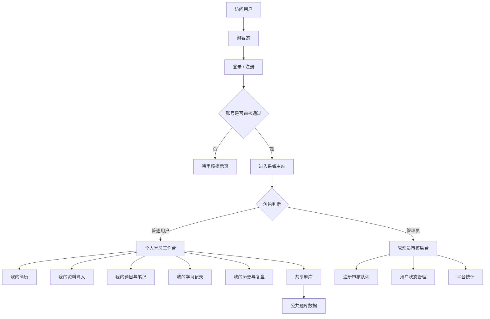

# 19_Auth_and_MultiTenant_Architecture_Draft

## 1. 背景与目标

当前项目已经具备登录功能的基础，但权限体系尚未真正接入页面与业务数据隔离。随着项目从“单人使用的题库工具”演进为“带登录、个人数据隔离、审核注册、管理员入口的学习平台”，系统需要从简单的前端登录态，升级为一套完整的 **认证 + 授权 + 多租户数据隔离** 方案。

本需求的核心目标是：

- 题库内容仍然允许所有用户共享浏览与使用。
- 每个登录用户只能看到自己的上传内容、题目、简历、学习过程、历史记录、训练记录等。
- 系统支持一个管理员账户入口，用于审核新注册用户是否允许登录。
- 登录功能不只是“能进入页面”，而是作为全站权限边界的入口。
- 后续所有与个人相关的数据，都必须带有用户归属关系，并在查询层强制隔离。

---

## 2. 需求理解

这个项目可以拆成两类数据域：

### 2.1 公共共享域
这类数据对所有用户可见：
- 通用题库
- 公共知识点
- 系统默认模板
- 可公开复用的题目分类
- 平台级说明与帮助内容

### 2.2 私人用户域
这类数据只能被对应登录用户访问：
- 用户上传的简历
- 用户导入的面试资料
- 用户生成的个人题目
- 用户的学习记录
- 用户的刷题历史
- 用户的错题本
- 用户的 AI 对话历史
- 用户的任务进度与归档数据
- 用户自定义标签、收藏、笔记、复盘内容

### 2.3 管理员域
管理员拥有特殊权限：
- 审核新注册用户是否允许登录
- 管理用户状态
- 查看用户注册与审核队列
- 必要时封禁或禁用账号
- 可查看平台级统计，但不能默认读取所有用户私有学习内容，除非明确赋权

---

## 3. 总体架构目标

建议把系统权限架构升级为以下 4 层：

1. **身份认证层**：确认你是谁
2. **权限授权层**：确认你能做什么
3. **数据归属层**：确认这份数据属于谁
4. **访问控制层**：确认当前请求是否允许访问该资源

也就是说，登录不是终点，而是所有数据访问的前置条件。

---

## 4. 业务角色设计

### 4.1 游客（未登录）
权限范围：
- 查看公开首页
- 查看平台介绍
- 查看公开题库的部分内容或只读入口
- 访问登录页、注册页

限制：
- 不能进入个人工作台
- 不能查看个人数据
- 不能上传个人资料
- 不能查看学习历史

### 4.2 普通用户（已注册、已审核、已登录）
权限范围：
- 查看公共题库
- 上传并管理自己的简历、资料、题目、笔记
- 进入个人学习页面
- 使用 AI 训练与模拟面试
- 查看自己的历史记录与统计
- 收藏、标注、归档自己的内容

限制：
- 不能访问别人的私有数据
- 不能管理用户审核
- 不能进入管理员后台

### 4.3 待审核用户
权限范围：
- 完成注册
- 查看“审核中”状态页
- 补充必要信息

限制：
- 不能正常登录到主系统
- 不能访问个人工作台核心功能
- 需要管理员审核通过后才能正式登录

### 4.4 管理员
权限范围：
- 登录管理后台
- 审核注册用户
- 调整用户状态
- 查看平台概览
- 管理公共题库基础配置

限制：
- 默认不直接访问普通用户私有学习内容
- 敏感操作要留审计记录

---

## 5. 功能架构拆解

---

## 6. 鉴权系统设计原则

### 6.1 共享与私有必须分离
题库属于共享域，个人学习资料属于私有域。不要把所有表都默认按用户隔离，否则会让公共题库失去共享价值；也不要让私有数据裸露在公共查询接口中。

### 6.2 认证与授权必须分层
- 认证负责识别登录身份
- 授权负责判断角色与资源权限
- 数据层负责限制数据归属

### 6.3 所有私有接口必须强制带用户上下文
例如：
- 创建简历时必须写入 `user_id`
- 查询学习记录时必须按 `user_id` 过滤
- 查看历史记录时不能只靠前端隐藏按钮

### 6.4 管理权限必须显式声明
管理员权限不能通过前端页面控制来伪装，必须在后端鉴权中明确校验。

### 6.5 审核状态是登录链路的一部分
不是所有注册成功的人都能立即使用系统。注册后如果处于未审核状态，应只能访问受限页面。

---

## 7. 建议的数据模型方向

> 这里先给出架构级建议，不强制立即定最终表结构。

### 7.1 用户基础表
建议字段包括：
- `id`
- `email` / `username`
- `password_hash`
- `role`（user / admin）
- `status`（pending / approved / rejected / disabled）
- `created_at`
- `updated_at`
- `last_login_at`

### 7.2 审核记录表
建议字段包括：
- `id`
- `user_id`
- `reviewer_id`
- `status`
- `remark`
- `reviewed_at`
- `created_at`

### 7.3 私有资源统一归属字段
用户私有数据表建议统一包含：
- `user_id`
- `created_at`
- `updated_at`
- `deleted_at`（如需要软删）

适用于：
- 简历
- 导入资料
- 题目草稿
- 学习记录
- 历史对话
- 错题本
- 收藏夹
- 复盘内容

### 7.4 公共题库表
公共题库可不依赖单一用户所有权，但可以考虑：
- `is_public`
- `source_type`
- `owner_type`
- `visibility`

用于兼容未来的“公共 + 个人”混合模式。

---

## 8. 页面与路由层建议

### 8.1 公开页面
- 首页
- 登录页
- 注册页
- 注册结果页
- 审核中提示页
- 公共题库浏览页（只读）

### 8.2 登录后普通用户页面
- 个人首页 / 工作台
- 我的简历
- 我的导入
- 我的题目
- 我的学习记录
- 我的历史
- 我的错题本
- 我的训练报告

### 8.3 管理员页面
- 审核队列
- 用户管理
- 注册审批详情
- 平台统计
- 公共题库管理（如需要）

---

## 9. 接口与中间件架构建议

### 9.1 认证接口
- 注册
- 登录
- 登出
- 刷新 token / session
- 获取当前用户信息

### 9.2 授权中间件
建议在前后端都做：
- 前端负责导航控制与 UI 提示
- 后端负责真正的访问判断
- 路由中间件负责拦截未登录与未审核用户

### 9.3 资源级权限校验
对每一个私有资源接口都必须做：
- 当前用户是否登录
- 当前用户是否已审核通过
- 当前资源是否属于当前用户
- 当前用户是否具备管理员权限（如适用）

---

## 10. 关键业务流程

### 10.1 用户注册与审核流程
1. 用户填写注册信息
2. 系统创建账号，默认状态为 `pending`
3. 用户看到“等待审核”提示
4. 管理员在后台查看注册申请
5. 管理员审批通过后，账号状态变为 `approved`
6. 用户重新登录后进入正式系统

### 10.2 用户登录与访问流程
1. 用户登录
2. 系统验证身份
3. 检查账号状态是否通过审核
4. 若未通过，禁止进入主系统
5. 若通过，读取角色信息
6. 根据角色进入普通用户区或管理员后台

### 10.3 私有数据访问流程
1. 前端发起请求
2. 后端识别当前登录用户
3. 查询语句自动加上 `user_id`
4. 返回当前用户自己的数据
5. 任何越权请求直接拒绝

---

## 11. 权限边界定义

### 11.1 必须保护的资源
- 简历内容
- 上传文件
- AI 交互记录
- 学习进度
- 错题记录
- 个人统计
- 历史导入日志

### 11.2 可共享资源
- 公共题库
- 公共题目分类
- 公共学习模板
- 平台说明文档

### 11.3 必须审计的操作
- 用户审核通过 / 拒绝
- 用户封禁 / 解封
- 管理员权限调整
- 私有数据导出
- 敏感数据删除

---

## 12. 推荐的开发拆分顺序

建议分成 6 个阶段：

### 阶段 1：登录体系接入
- 统一登录态
- 当前用户信息接口
- 页面级登录保护

### 阶段 2：用户角色与审核状态
- 增加角色字段
- 增加审核状态字段
- 注册后默认 pending
- 审核中页面

### 阶段 3：数据归属改造
- 所有私有表补充 `user_id`
- 查询接口按用户过滤
- 前端只展示当前用户数据

### 阶段 4：管理员后台
- 审核注册用户
- 查看待审列表
- 管理用户状态

### 阶段 5：路由与页面保护
- 登录前后路由跳转
- 审核未通过拦截
- 管理员路由隔离

### 阶段 6：审计与完善
- 操作日志
- 越权访问日志
- 错误处理与提示优化

---

## 13. 风险点与注意事项

### 13.1 只做前端控制会失效
如果只是前端隐藏按钮，用户依旧可以直接调用接口访问别人的数据。

### 13.2 私有数据历史遗留问题
如果历史数据没有 `user_id`，需要制定迁移方案，否则无法做隔离。

### 13.3 登录态与审核态要分开
“已登录”不等于“可用”；“注册成功”不等于“已授权”。

### 13.4 公共题库不要误伤
不能因为做了用户隔离，就把共享题库也锁成私人数据。

---

## 14. 面向 Claude Code 的实现提示要点

后续如果让 Claude Code 继续开发，务必遵循：
- 先读本架构文档，再读现有系统架构与数据库文档
- 先实现认证与权限边界，再改业务页面
- 先改后端鉴权，再改前端展示
- 所有私有资源接口必须逐一校验 `user_id`
- 管理员审核功能优先做成最小可用闭环

---

## 15. 阶段性交付目标

### 第一阶段交付
- 用户可以注册
- 注册后默认待审核
- 管理员可审核通过
- 通过后可登录系统

### 第二阶段交付
- 所有私有数据按用户隔离
- 用户只能看到自己的简历、导入内容、学习记录
- 公共题库仍然开放共享

### 第三阶段交付
- 管理员后台完整可用
- 审核流、状态流、访问控制流全部打通

---

## 16. 最终目标

最终希望系统形成一种清晰的权限秩序：

- 公共内容开放共享
- 个人内容严格归属
- 登录是入口
- 审核是闸门
- 管理员是维护者
- 所有用户行为可追踪、可隔离、可扩展

这会让项目从一个“单机式个人工具”升级为“具备真实 SaaS 权限模型的学习平台”。
