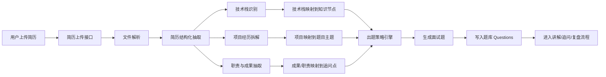

# Resume_Driven_Interview_Design

## 1. 设计目标

本设计文档用于定义“**简历驱动面试出题**”能力的完整工程方案。该能力不是一个附加小功能，而是本项目 MVP 阶段的核心输入能力之一。

目标是让系统在用户上传简历后，自动完成：

- 简历解析
- 技术栈识别
- 项目经历拆解
- 业务职责抽取
- 能力点映射
- 面试题生成
- 题目分层
- 追问策略生成
- 与现有知识库、错题集、学习记录、LangGraph 流程联动

### 1.1 核心原则

- 题目必须来源于简历内容，而不是凭空生成
- 每道题都要能追溯到简历原文证据
- 简历解析、技术栈映射、出题、追问必须拆成独立模块
- 输出题目必须分层，先基础、再进阶、再深挖
- 题目生成必须可控、可配置、可重跑
- 必须兼容现有的题库、标签、知识节点、学习记录和对话流程

### 1.2 与现有框架的关系

简历驱动出题能力要无缝接入现有系统：

- 输入层：`Files` / `Resumes`
- 结构化层：`Resume_Experiences`
- 映射层：`Question_Knowledge_Nodes` / `Tags`
- 出题层：`Questions`
- 讲解与追问层：`LangGraph`
- 复习层：`Study_Records` / `Learning_Profiles`

---

## 2. 整体处理流程



---

## 3. 简历解析设计

### 3.1 输入类型

支持以下简历输入方式：

- PDF
- Word（docx）
- 图片扫描件
- 纯文本粘贴
- 未来可扩展网页简历导入

### 3.2 解析目标

简历解析阶段不直接出题，先完成结构化理解。解析结果至少包含：

- 基本信息
- 教育背景
- 工作经历
- 项目经历
- 技能栈
- 语言与证书（如有）
- 其他补充信息

### 3.3 解析输出结构

建议统一输出如下结构：

```json
{
  "resume_id": "uuid",
  "basic_info": {
    "name": "蔡宏伟",
    "phone": "",
    "email": ""
  },
  "education": [],
  "work_experiences": [],
  "project_experiences": [],
  "skill_stack": [],
  "certificates": [],
  "structured_summary": {},
  "parse_confidence": 0.92
}
```

### 3.4 简历切片原则

- 教育背景通常只作为补充问答来源
- 工作经历优先提炼能力点、职责点、成果点
- 项目经历是出题的最强来源
- 技术栈是知识节点映射的核心入口
- 数值结果、量化成果、架构方案、优化手段都应优先转成追问素材

### 3.5 解析红线

- 不允许把整份简历当成一段纯文本直接扔给出题模型
- 不允许解析完不落库
- 不允许丢失原文证据
- 不允许把职责和成果混成一个不可分离字段

---

## 4. 技术栈映射设计

### 4.1 映射目标

把简历中的技术栈映射成系统内部可理解的知识节点、标签和题目主题。

例如：

- `FastAPI` -> Web API、异步、后端框架、路由设计
- `LangGraph` -> 状态机、节点编排、条件边、Agent 流程
- `RAG` -> 向量检索、召回、重排、上下文拼接
- `MCP` -> 工具协议、解耦、外部系统接入
- `Function Calling` -> 函数调用、槽位抽取、工具路由
- `LoRA` -> 参数高效微调、权重注入、训练策略

### 4.2 映射策略

#### 规则映射
对于明确的标准技术名，优先使用规则映射：
- 关键词命中
- 同义词归一
- 缩写展开

#### 语义映射
对于描述型技术能力，使用 embedding + reranker 召回最相关的知识节点：
- “任务型对话” -> 对话管理 / 状态机 / 槽位抽取
- “复杂表格解析” -> OCR / 版面分析 / 文档理解
- “检索增强” -> RAG / 召回 / 重排 / 向量库

#### 项目语义映射
对于项目经历，按“目标、技术方案、职责、成果”四个维度拆分后再映射：
- 技术方案映射到知识节点
- 职责映射到行为题和架构题
- 成果映射到量化追问

### 4.3 映射输出

每个技术栈建议输出：
- `canonical_name`
- `alias_names`
- `knowledge_nodes`
- `question_tags`
- `confidence`
- `source_evidence`

### 4.4 映射红线

- 不能只靠大模型自由发挥生成标签
- 不能把技术栈映射成过于泛化的标签
- 不能忽略项目中的高价值技术名词
- 不能把相同技术在不同上下文下的含义混淆

---

## 5. 出题策略设计

### 5.1 出题目标

出题必须围绕简历内容进行，且能够模拟真实面试官的追问逻辑。出题不是随机抽题，而是有策略地覆盖：

- 基础认知
- 项目深挖
- 架构设计
- 工程实践
- 风险与权衡
- 追问验证

### 5.2 出题来源

题目来源应分为四类：

1. **技术栈题**
   - 围绕简历中的关键技术栈提问
   - 如 FastAPI、LangGraph、RAG、MCP、Redis、Milvus、LoRA 等

2. **项目题**
   - 围绕项目背景、目标、方案、结果提问
   - 如“为什么采用双路召回？”、“为什么要用状态机？”

3. **职责题**
   - 围绕个人职责、决策、实现方式提问
   - 如“你如何设计对话流转？”、“你如何做 SQL 校验？”

4. **成果追问题**
   - 围绕量化结果、性能指标、优化效果提问
   - 如“85% 提升到 98% 具体怎么做到的？”

### 5.3 出题层级

为了保证由浅入深，题目必须分层：

#### 第一层：基础确认题
- 目的：确认候选人是否真的做过
- 示例：请解释你项目中用到的 Function Calling 是什么

#### 第二层：实现细节题
- 目的：验证技术实现能力
- 示例：槽位抽取和工具调用之间是如何串联的

#### 第三层：架构设计题
- 目的：验证系统设计能力
- 示例：为什么你要用状态机而不是纯 Prompt 流程

#### 第四层：权衡与优化题
- 目的：验证工程思维
- 示例：你如何处理大模型二次生成带来的延迟

#### 第五层：追问与边界题
- 目的：验证深度和真实性
- 示例：如果 MCP 工具调用失败，你的兜底策略是什么

### 5.4 出题权重策略

建议按以下权重分配：
- 核心项目经历：40%
- 核心技术栈：30%
- 量化成果：15%
- 通用基础知识：10%
- 软技能与协作：5%

### 5.5 出题红线

- 不允许脱离简历内容空泛出题
- 不允许题目过度重复
- 不允许所有题都停留在“概念解释”
- 不允许一次性出太多高难题，必须从浅到深
- 不允许题库脱离简历上下文单独存在

---

## 6. 题目分层与生成格式

### 6.1 标准题目结构

每道题建议至少包含以下字段：

- `question_text`
- `question_type`
- `difficulty_level`
- `source_type`
- `source_evidence`
- `related_knowledge_nodes`
- `followup_hints`
- `expected_answer_points`
- `generation_version`

### 6.2 题目序列策略

推荐不要只生成单道题，而是生成题目序列：

- 先技术栈题
- 再项目题
- 再职责题
- 再追问题
- 最后综合架构题

这样系统更接近真实面试流程，也更利于持续学习。

### 6.3 难度控制

建议将难度划分为 1 到 5 级：

- 1 级：定义题、概念确认
- 2 级：基础实现、常见使用
- 3 级：项目落地、流程设计
- 4 级：架构权衡、性能优化
- 5 级：追问深挖、边界条件、故障处理

### 6.4 题目去重

生成前必须检查：
- 同一简历段落是否已经生成过类似题
- 当前题是否与已有题语义重复
- 当前题是否与知识库已有高频题冲突过强

---

## 7. 追问逻辑设计

### 7.1 追问的作用

追问不是为了刁难，而是为了验证：

- 你是否真做过
- 你是否理解背后原理
- 你是否知道工程边界
- 你是否能解释权衡与取舍

### 7.2 追问策略

#### 基础追问
当候选人回答过于简短时：
- 你能展开讲一下实现链路吗？
- 你在项目中负责哪一部分？

#### 原理追问
当回答偏现象时：
- 为什么要这样设计？
- 如果不用这个方案会怎样？

#### 工程追问
当回答偏理论时：
- 线上如何保证稳定性？
- 如何处理失败重试？

#### 边界追问
当回答较完整时：
- 哪些场景下这个方案不适用？
- 如果数据量翻倍你会怎么改？

### 7.3 追问触发条件

- 回答覆盖率低
- 回答过于笼统
- 回答缺少量化结果解释
- 回答提到了关键技术但没有展开
- 回答与简历证据不一致

### 7.4 追问红线

- 不要一次追太多点
- 不要脱离简历内容追问
- 不要只追概念，不追实现
- 不要只追实现，不追权衡

---

## 8. 与 LangGraph 的集成方式

简历驱动出题推荐接入以下工作流节点：

1. `ResumeExtractor`
2. `ResumeMapper`
3. `QuestionGenerator`
4. `Retriever`
5. `Interviewer`
6. `Evaluator`
7. `Persister`

### 8.1 推荐流程

- 先解析简历
- 再做结构化映射
- 再生成题目序列
- 再根据用户回答进行追问和评价
- 最后写入学习记录和个人画像

### 8.2 状态建议

状态中建议额外保留：
- `resume_id`
- `resume_section`
- `source_evidence`
- `question_cluster`
- `generation_strategy`
- `question_batch_id`

---

## 9. MVP 落地建议

### 9.1 MVP 第一期只做什么

- 简历上传
- 简历文本解析
- 技术栈提取
- 项目经历提取
- 根据简历生成 10-20 道强相关题
- 展示题目列表与来源证据

### 9.2 MVP 第二期再做什么

- 题目难度分层
- 追问逻辑
- 模拟面试
- 答案评分
- 错题复盘
- 学习画像更新

### 9.3 MVP 阶段不要做什么

- 不要做复杂多用户权限体系
- 不要做过重的推荐算法
- 不要做复杂知识图谱可视化
- 不要在第一版就追求全自动无人工确认

---

## 10. 最终结论

简历驱动出题的本质不是“让系统随机出题”，而是：

> 把简历中的技术栈、项目经历、职责成果结构化，再把结构化结果映射为一套有来源、有层次、有追问能力的面试题系统。

只要遵守“结构化解析 → 映射 → 出题 → 追问 → 评价 → 复盘”的链路，这个功能就能和你现有的面试知识库、错题集、LangGraph 和学习记录系统自然融合，并且具备长期演进能力。

