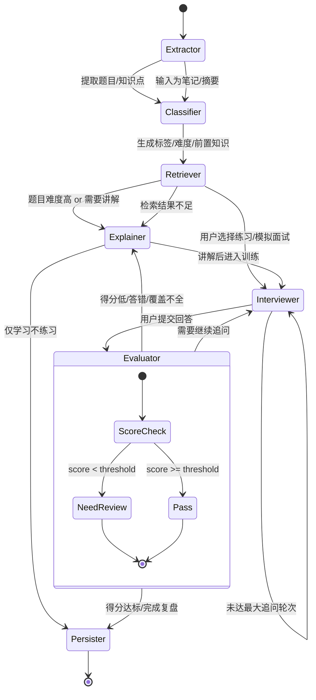

# 04_LangGraph_Workflow

## 1. 设计目标

LangGraph 是本项目后端智能体核心，负责把“题目输入—结构化理解—知识讲解—追问—评分—复盘”组织成一个**有状态、可循环、可分支、可中断恢复**的工作流。

这个工作流要解决的问题不是单轮问答，而是：

- 自动识别输入内容属于什么类型
- 自动抽取题目、知识点与简历中的技术栈/项目经历
- 自动决定是讲解、追问还是模拟面试
- 根据用户回答动态调整下一步
- 将错题、薄弱点和复习计划沉淀到数据库
- 依据简历内容定向出题，而不是凭空生成泛化题目

### 1.1 架构演进约束

本工作流不是一次性 prompt 链，而是一个可长期演进的状态机系统。它必须遵守：

- 节点可插拔
- State 可版本化
- 条件边可配置
- Prompt 可分版本管理
- 节点输出必须尽量结构化
- 节点之间不得通过隐式全局变量耦合
- 不得把所有逻辑写成一个巨型执行函数

### 1.2 红线要求

- 不允许在节点内部直接写死业务 API 调用逻辑
- 不允许把模型调用散落在各个节点里
- 不允许用字符串拼接方式维护复杂状态
- 不允许没有 schema 的“大字典”长期横跨整个工作流
- 不允许把讲解、追问、评分混写在同一个节点里

### 1.3 与数据库约束的配合

- 节点输出要能够写入 `Prompt_Versions`
- 题目/学习记录要携带 `model_version` 与 `prompt_version`
- 学习画像 `Learning_Profiles` 应支持实时更新和后续定时校正
- 复习逻辑应能与简化 SM-2 策略对接
- 简历解析结果必须落入 `Resumes` 与 `Resume_Experiences`，并作为后续出题的结构化输入

---

## 2. State 状态字典设计

建议使用一个统一的状态字典 `state` 贯穿整条图，但它必须是**显式 Schema** 而不是随意扩展的散装字典。状态字段建议分为以下几类：

### 2.1 输入类

| 键名 | 类型 | 说明 |
|---|---|---|
| input_text | str | 用户输入的原始文本 |
| input_source | str | 输入来源，如 upload/paste/chat/manual |
| session_id | str | 会话 ID |
| user_id | str | 用户 ID，MVP 可为空但预留 |
| file_id | str | 文件 ID |
| resume_id | str | 简历 ID |
| question_id | str | 当前题目 ID |
| run_id | str | 本次工作流运行 ID |

### 2.2 解析与理解类

| 键名 | 类型 | 说明 |
|---|---|---|
| parsed_content | list / dict | 解析后的中间结构 |
| question_text | str | 当前识别出的题目 |
| question_type | str | 题型 |
| domain_type | str | 所属知识域 |
| difficulty_level | int | 难度 |
| tags | list[str] | 标签列表 |
| knowledge_points | list[str] | 知识点列表 |
| prerequisites | list[str] | 前置知识 |
| retrieval_hits | list[dict] | 检索命中结果 |

### 2.3 生成与交互类

| 键名 | 类型 | 说明 |
|---|---|---|
| answer_short | str | 简版答案 |
| answer_detail | str | 深度答案 |
| explanation | str | 分层讲解 |
| user_answer | str | 用户本轮回答 |
| followup_questions | list[str] | 追问题目 |
| chat_history | list[dict] | 对话上下文 |
| memory_summary | str | 历史对话摘要 |

### 2.4 评价与训练类

| 键名 | 类型 | 说明 |
|---|---|---|
| user_score | int | 评分结果 |
| evaluation | dict | 评价详情 |
| feedback | str | 点评与纠错 |
| mastery_level | int | 掌握度 |
| review_needed | bool | 是否进入复习 |
| next_action | str | 下一步动作，如 explain/ask/evaluate/review/save |
| review_cycle | str | 复习周期策略 |

### 2.5 持久化与运行控制类

| 键名 | 类型 | 说明 |
|---|---|---|
| persist_flag | bool | 是否落库 |
| error_message | str | 错误信息 |
| metadata | dict | 扩展信息 |
| model_version | str | 当前模型版本 |
| prompt_version | str | 当前 prompt 版本 |
| state_version | str | 状态结构版本 |

### 2.6 状态设计约束

- 字段必须命名稳定，不能随意重命名
- 新增字段必须明确用途与归属
- 不允许节点直接修改不属于自己的核心字段
- 不允许状态中长期塞入未结构化大文本作为唯一沟通方式
- 必须支持后续版本化与序列化

---

## 3. Node 节点职责设计

### 3.1 ResumeExtractor Node 简历提取器

#### 目标
从简历原始文本中识别个人信息、工作经历、项目经历、教育背景、技能栈，并输出结构化简历内容，作为后续出题的基础输入。

#### 处理逻辑
- 读取 `input_text` 或解析后的简历文本
- 按教育背景、工作经历、项目经历、技能栈等区域切片
- 抽取公司、项目名、职位、时间、职责、技术栈、成果
- 生成 `Resume_Experiences` 所需结构
- 标记高相关出题区域，例如项目经历与核心技术栈

#### Prompt 思路
- 只做简历结构化抽取，不生成面试题
- 强调必须保留原文证据片段
- 输出 JSON，字段包括经历类型、项目名、技术栈、职责、成果、置信度
- 若解析不完整，输出待补全字段列表

#### 输出
- `resume_id`
- `parsed_content`
- `next_action`

---

### 3.2 ResumeMapper Node 简历映射器

#### 目标
将简历中的技术栈、项目经历、职责描述映射到知识节点、标签与出题主题。

#### 处理逻辑
- 识别简历中的核心技术栈，如 FastAPI、LangGraph、RAG、Milvus、LoRA、MCP 等
- 把每个技术栈映射到知识节点
- 把项目经历映射到候选问题类型：原理题、架构题、项目题、追问题、对比题
- 计算每一类题目的优先级与权重

#### Prompt 思路
- 输入是结构化简历，而不是原始长文本
- 输出“可出题主题”和“可追问点”
- 标出高置信度区域与低置信度区域
- 区分“技能栈题”和“项目深挖题”

#### 输出
- `knowledge_points`
- `tags`
- `question_clusters`
- `next_action`

---

### 3.3 QuestionGenerator Node 出题器

#### 目标
基于简历结构化结果生成面试题，做到“题目与简历强相关”。

#### 处理逻辑
- 读取 `Resume_Experiences`、`knowledge_points`、`tags`
- 按技术栈、项目、职责、成果拆分出题
- 为每道题标记来源：技术点 / 项目经历 / 职责描述 / 成果追问
- 控制题目难度分布，从浅到深逐步递进
- 避免生成与简历无关的泛化题

#### Prompt 思路
- 所有题目必须能追溯到简历中的某一段原文或某个技术栈
- 输出题目时附带 `source_evidence` 和 `source_type`
- 支持按“技术栈题”“项目题”“追问题”分类
- 支持生成题目序列，而不是单道孤立题

#### 输出
- `question_text`
- `question_type`
- `difficulty_level`
- `source_evidence`
- `next_action`

---

### 3.4 Extractor Node 提取器

#### 目标
从原始输入中识别题目、标题、段落结构、可能的问答对，并输出统一结构。该节点也可用于非简历场景的题目/笔记抽取，作为通用入口。
#### 处理逻辑
- 读取 `input_text`
- 识别分隔符、编号、标题、列表结构
- 如果输入来自文件解析结果，则直接读取中间文本
- 如果是长文案，按段落切分成多个候选题
- 识别是否包含多个知识点或多个题目
- 尽量只做“抽取”，不做“解释”

#### Prompt 思路
- 要求模型只做信息抽取，不做解释
- 输出 JSON，字段包括题目、上下文、候选答案、疑似标签
- 如果文本中存在多题，返回题目数组
- 若输入不是题目，而是知识卡片或笔记，则标识为 `note` 类型

#### 输出
- `question_text`
- `parsed_content`
- `input_source`
- `next_action`

---

### 3.2 Classifier Node 分类器

#### 目标
给题目自动分类、打标签、估计难度、识别题型。

#### 处理逻辑
- 基于 `question_text` 和 `parsed_content`
- 判断知识域：RAG、Agent、LangGraph、Prompt、向量库、部署、评估等
- 判断题型：概念题、对比题、场景题、架构题、项目题、追问题
- 输出标签与难度评分
- 如果命中多个领域，允许多标签并存

#### Prompt 思路
- 使用固定标签集合 + 允许补充自定义标签
- 要求给出难度评分依据
- 让模型输出结构化结果，而不是长篇解释
- 题目分类与难度评估要与知识点推荐解耦

#### 输出
- `question_type`
- `domain_type`
- `difficulty_level`
- `tags`
- `knowledge_points`
- `prerequisites`
- `next_action`

---

### 3.3 Retriever Node 检索器

#### 目标
从知识库中召回相似题、相关知识点、前置内容。

#### 处理逻辑
- 将题目或用户回答转成 embedding
- 在向量库中检索相似题
- 合并标签、知识点与历史学习记录
- 为讲解器和面试官提供上下文增强

#### Prompt 思路
- 检索器不负责生成长答案，只负责上下文补全
- 要求输出简短、结构化、可供下游节点消费的结果
- 检索结果要支持置信度排序

#### 输出
- `retrieval_hits`
- `related_questions`
- `prerequisites`
- `next_action`

---

### 3.4 Explainer Node 讲解器

#### 目标
根据题目与用户当前掌握度生成分层讲解。

#### 处理逻辑
- 先生成一句话答案
- 再生成面试版答案
- 再生成深入版答案
- 结合用户历史薄弱点，突出易错部分
- 关联知识点与前置知识
- 讲解应服务于“理解与表达”，而不是单纯“文本生成”

#### Prompt 思路
- 分层输出：一句话、30 秒、1 分钟、深度版
- 要求讲解顺序从易到难
- 面向“面试表达”而不是论文风格
- 如果属于高难题，优先说明前置知识
- 输出必须兼容后续追问与复盘

#### 输出
- `answer_short`
- `answer_detail`
- `explanation`
- `related_questions`
- `next_action`

---

### 3.5 Interviewer Node 面试官

#### 目标
模拟真实面试追问，帮助用户练习表达。

#### 处理逻辑
- 读取当前题目、知识点、难度和用户历史表现
- 生成一个问题或一组递进追问
- 根据用户回答决定继续追问还是进入评价
- 可设置“限时回答”模式
- 该节点必须与讲解器解耦，避免“边讲边问”导致职责混乱

#### Prompt 思路
- 角色设定为“严格但专业的 AI 面试官”
- 优先追问用户回答中的空洞表达、缺失环节、概念混淆
- 追问应该逐步加深
- 对高频题要模拟真实面试官风格，对基础题要先确认概念完整性

#### 输出
- `followup_questions`
- `question_text`
- `next_action = ask`

---

### 3.6 Evaluator Node 评价器

#### 目标
对用户回答进行评分、纠错、总结和复盘建议输出。

#### 处理逻辑
- 对比标准答案与用户回答
- 判断是否覆盖关键点
- 识别概念错误、表达模糊、缺少项目结合、缺少举例等问题
- 输出分数和改进建议
- 决定是否需要回到讲解器或继续追问

#### Prompt 思路
- 明确评分维度：准确性、完整性、表达结构、面试适配度
- 给出“为什么扣分”的理由
- 给出“如何升级回答”的建议
- 评价结果应结构化，便于写入学习记录

#### 输出
- `user_score`
- `evaluation`
- `feedback`
- `mastery_level`
- `review_needed`
- `next_action`

---

### 3.7 Persister Node 持久化器

#### 目标
把本轮结果写入数据库，形成学习轨迹。

#### 处理逻辑
- 保存题目、标签、答案、对话记录、学习记录
- 写入复习时间与掌握度
- 记录模型输出摘要，便于后续复盘
- 持久化应由 service / repository 完成，节点只负责触发意图，不直接操纵底层表结构

#### 输出
- `persist_flag = true`
- `next_action = save`

---

## 4. Conditional Edges 条件边设计

下面是核心跳转逻辑。条件边必须是**显式规则**，而不是让模型随意决定全部流程。

### 4.1 基本流程

1. 输入进入 `Extractor`
2. 进入 `Classifier`
3. 进入 `Retriever`
4. 如果是简单题或用户只需要解释，则进入 `Explainer`
5. 如果用户要求练习，则进入 `Interviewer`
6. 用户回答后进入 `Evaluator`
7. 根据评价结果决定是否回到 `Explainer` 或进入 `Review`
8. 最后进入 `Persister`

### 4.2 条件跳转规则

#### 规则 A：题目太难
- 条件：`difficulty_level >= 4` 或 `prerequisites` 缺失较多
- 跳转：`Classifier -> Explainer`
- 目的：先补前置知识，再进入追问

#### 规则 B：用户明确要练习
- 条件：输入中包含“模拟面试 / 出题 / 追问 / 练习”
- 跳转：`Retriever -> Interviewer`
- 目的：直接进入训练模式

#### 规则 C：用户回答错误或覆盖不全
- 条件：`user_score < threshold`
- 跳转：`Evaluator -> Explainer`
- 目的：先纠错，再重新提问

#### 规则 D：用户答得很好
- 条件：`user_score >= threshold`
- 跳转：`Evaluator -> next_question / Persister`
- 目的：进入下一题或保存结果

#### 规则 E：输入不是题目而是笔记
- 条件：`Extractor` 判断为知识点笔记而非问题
- 跳转：`Extractor -> Classifier -> Explainer`
- 目的：转成知识卡片进行学习

#### 规则 F：检索结果不足
- 条件：`retrieval_hits` 为空或置信度过低
- 跳转：`Retriever -> Explainer`
- 目的：降级为通用讲解，避免因检索空缺导致流程中断

#### 规则 G：流程超出最大追问轮次
- 条件：`followup_turns >= max_turns`
- 跳转：`Interviewer -> Evaluator -> Persister`
- 目的：防止无限循环，确保会话可终止

---

## 5. Mermaid 状态机流转图

---

## 6. Prompt 设计原则

### 6.1 通用原则

- 所有节点尽量输出 JSON
- 严禁自由发挥式长文本污染状态
- Prompt 要固定角色、固定目标、固定输出字段
- 使用少量 few-shot 示例提升稳定性
- Prompt 内容应版本化，不要散落在代码里

### 6.2 提取器 Prompt 关键点

- 只抽取，不解释
- 识别多题拆分
- 保留原文引用片段
- 如非题目，则标记内容类型，交给后续节点处理

### 6.3 分类器 Prompt 关键点

- 先判断题型，再判断领域
- 允许一个题命中多个标签
- 输出难度解释理由
- 生成结果必须能被后续检索与学习模块使用

### 6.4 讲解器 Prompt 关键点

- 输出分层答案
- 从面试表达角度组织语言
- 强调“为什么”与“怎么落地”
- 必须保留可用于追问的关键点

### 6.5 面试官 Prompt 关键点

- 追问要贴近真实面试风格
- 不要一次给太多提示
- 逐步提高难度
- 追问与评价要区分开，不要混为一谈

### 6.6 评价器 Prompt 关键点

- 按维度评分
- 指出缺失项
- 给出可执行改进建议
- 输出要支持学习记录落库

---

## 7. 可演进实现建议

### 7.1 节点实现策略

- 每个节点独立成文件
- 每个节点输入输出定义明确
- 节点依赖通过 service 或 adapter 注入
- 节点不要直接依赖具体模型供应商

### 7.2 State 演进策略

- 使用数据类或 Pydantic 模型定义 State
- 增加字段时保持向后兼容
- 不要依赖字段顺序
- 不要在不同节点之间约定未文档化的隐式字段

### 7.3 条件边演进策略

- 条件边逻辑写成可测试函数
- 跳转条件尽量配置化
- 对关键分支写单元测试
- 允许新增节点，但不要破坏现有主链路

### 7.4 与业务层的边界

LangGraph 只负责状态机流转与智能体编排，不负责：
- 直接操作数据库细节
- 直接写 HTTP 层代码
- 直接承担前端展示逻辑
- 直接管理复杂业务实体生命周期

这些职责应回到 `services/`、`domain/`、`infra/` 中。

---

## 8. 推荐的分阶段落地方式

### 阶段 1：线性链路
- Extractor -> Classifier -> Explainer -> Persister
- 先跑通导入和讲解闭环

### 阶段 2：增加训练分支
- 加入 Interviewer 和 Evaluator
- 支持模拟面试与复盘

### 阶段 3：增加检索增强
- 引入 Retriever
- 基于相似题与知识图谱补全上下文

### 阶段 4：加入循环学习
- 根据掌握度和复习间隔自动回到题目队列
- 形成持续学习闭环

---

## 9. 最终原则

LangGraph 的价值不在于“图画得多复杂”，而在于它是否把智能体流程真正做成了**可演进、可调试、可追踪、可复用**的工程系统。

如果某个实现会破坏这些特性，即便它短期看起来更快，也不应该进入主干代码。

